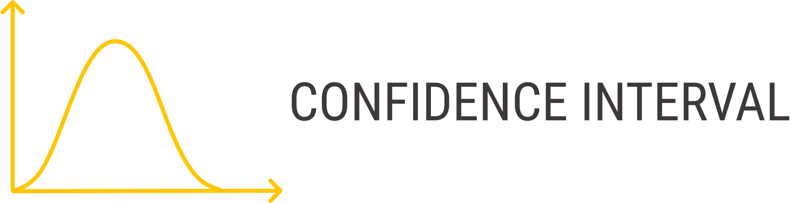

# The long missing python library for confidence intervals


[](https://opensource.org/licenses/MIT)

[](https://pepy.tech/project/confidenceinterval)
[](https://pepy.tech/project/confidenceinterval)

`pip install confidenceinterval`

This is a package that computes common machine learning metrics like F1, and returns their confidence intervals.


⭐ Very easy to use, with the standard scikit-learn naming convention and interface.

⭐ Support for many metrics, with modern confidence interval methods.

⭐ The only package with analytical computation of the CI for Macro/Micro/Binary averaging F1, Precision and Recall.

⭐ Support for both analytical computation of the confidence intervals, and bootstrapping methods.

⭐ Easy to use interface to compute confidence intervals on new metrics that don't appear here, with bootstrapping.

## The motivation

A confidence interval gives you a lower and upper bound on your metric. It's affected by the sample size, and by how sensitive the metric is to changes in the data.

When making decisions based on metrics, you should prefer narrow intervals. If the interval is wide, you can't be confident that your high performing metric is not just by luck.

While confidence intervals are commonly used by statisticans, with many great R language implementations,
they are astonishingly rarely used by python users, although python took over the data science world !

Part of this is because there were no simple to use python packages for this.


## Getting started

```python
# All the possible imports:
from confidenceinterval import roc_auc_score
from confidence interval import precision_score, recall_score, f1_score
from confidence interval import accuracy_score,
                                ppv_score,
                                npv_score,
                                tpr_score,
                                fpr_score,
                                tnr_score
from confidenceinterval.bootstrap import bootstrap_ci


# Analytic CI:
auc, ci = roc_auc_score(y_true,
                        y_pred,
                        confidence_level=0.95)
# Bootstrap CI:
auc, ci = roc_auc_score(y_true,
                        y_pred,
                        confidence_level=0.95,
                        method='bootstrap_bca',
                        n_resamples=5000)


```

## All methods do an analytical computation by default, but can do bootsrapping instead
By default all the methods return an analytical computation of the confidence interval (CI).

For a bootstrap computation of the CI for any of the methods belonw, just specify method='bootstrap_bca', or method='bootstrap_percentile' or method='bootstrap_basic'.
These are different ways of doing the bootstrapping, but method='bootstrap_bca' is the generalibly reccomended method.

You can also pass the number of bootstrap resamples (n_resamples), and a random generator for controling the reproducability:

```python
random_state = np.random.default_rng()
n_resamples=9999
```

## Support for binary, macro and micro averaging for F1, Precision and Recall.
```python
from confidence interval import precision_score, recall_score, f1_score
binary_f1, ci = f1_score(y_true, y_pred, confidence_interval=0.95, average='binary')
macro_f1, ci = f1_score(y_true, y_pred, confidence_interval=0.95, average='macro')
micro_f1, ci = f1_score(y_true, y_pred, confidence_interval=0.95, average='micro')
bootstrap_binary_f1, ci = f1_score(y_true, y_pred, confidence_interval=0.95, average='binary', method='bootstrap_bca', n_resamples=5000)

```

The analytical computation here is using the (amazing) 2022 paper of Takahashi et al (reference below).
The paper derived recall and precision only for micro averaging.
We derive the recall and precision confidence intervals for macro F1 as well using the delta method.


## ROC AUC
```python
from confidence interval import roc_auc_score
```
The analytical computation here is a fast implementation of the DeLong method.


## Binary metrics
```python
from confidence interval import accuracy_score,
                                ppv_score,
                                npv_score,
                                tpr_score,
                                fpr_score,
                                tnr_score
# Wilson is used by default:
ppv, ci = ppv_score(y_true, y_pred, confidence_level=0.95, method='wilson')
ppv, ci = ppv_score(y_true, y_pred, confidence_level=0.95, method='jeffreys')
ppv, ci = ppv_score(y_true, y_pred, confidence_level=0.95, method='agresti_coull')
ppv, ci = ppv_score(y_true, y_pred, confidence_level=0.95, method='bootstrap_bca')

```

For these methods, the confidence interval is estimated by treating the ratio as a binomial proportion,
see the [wiki page](https://en.wikipedia.org/wiki/Binomial_proportion_confidence_interval).

By default method='wilson', the wilson interval, which behaves better for smaller samples.

method can be one of ['wilson', 'normal', 'agresti_coull', 'beta', 'jeffreys', 'binom_test'], or one of the boostrap methods.

## Get a confidence interval for any custom metric with Bootstrapping
With the bootstrap_ci method, you can get the CI for any metric function that gets y_true and y_pred as arguments.

As an example, lets get the CI for the balanced accuracy metric from scikit-learn.

```python
from confidenceinterval.bootstrap import bootstrap_ci
# You can specify a random generator for reproducability, or pass None
random_generator = np.random.default_rng()
bootstrap_ci(y_true=y_true,
             y_pred=y_pred,
             metric=sklearn.metrics.balanced_accuracy_score,
             confidence_level=0.95,
             n_resamples=9999,
             method='bootstrap_bca',
             random_state=random_generator)
```


----------

Citation
If you use this for research, please cite. Here is an example BibTeX entry:

```
@misc{jacobgildenblatconfidenceinterval,
  title={A python library for confidence intervals},
  author={Jacob Gildenblat},
  year={2023},
  publisher={GitHub},
  howpublished={\url{https://github.com/jacobgil/confidenceinterval}},
}
```

----------

## References

The binomial confidence interval computation uses the statsmodels package:
https://www.statsmodels.org/dev/generated/statsmodels.stats.proportion.proportion_confint.html

Yandex data school implementation of the fast delong method:
https://github.com/yandexdataschool/roc_comparison

https://ieeexplore.ieee.org/document/6851192
X. Sun and W. Xu, "Fast Implementation of DeLong’s Algorithm for Comparing the Areas Under Correlated Receiver Operating Characteristic Curves," in IEEE Signal Processing Letters, vol. 21, no. 11, pp. 1389-1393, Nov. 2014, doi: 10.1109/LSP.2014.2337313.

https://www.ncbi.nlm.nih.gov/pmc/articles/PMC8936911/#APP2

Confidence interval for micro-averaged F1 and macro-averaged F1 scores
`Kanae Takahashi,1,2 Kouji Yamamoto,3 Aya Kuchiba,4,5 and Tatsuki Koyama6`

B. Efron and R. J. Tibshirani, An Introduction to the Bootstrap, Chapman & Hall/CRC, Boca Raton, FL, USA (1993)

http://users.stat.umn.edu/~helwig/notes/bootci-Notes.pdf
`Nathaniel E. Helwig, “Bootstrap Confidence Intervals”`


Bootstrapping (statistics), Wikipedia, https://en.wikipedia.org/wiki/Bootstrapping_%28statistics%29